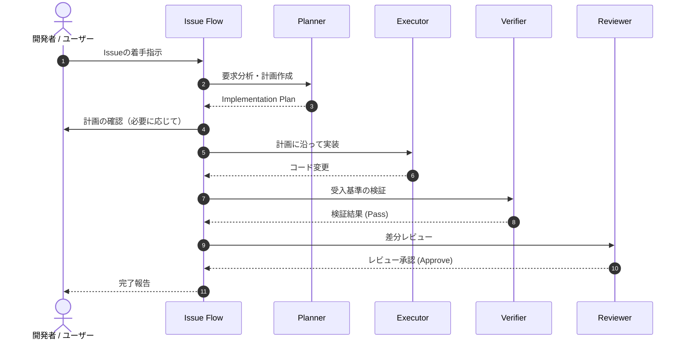

# AI駆動開発アーキテクチャ (AI Development Architecture)

## 概要

本プロジェクトでは、AIエージェントによる開発の品質、再現性、および安全性を最大化するために、役割を分離したSkillベースのワークフローを採用しています。

## 役割分担（Skill分離）

| Role / Skill | 責務 | 成果物 |
| :--- | :--- | :--- |
| **Planner** | Issue/要求分析、要件定義、タスク分解、検証計画策定（コードは書かない） | Implementation Plan |
| **Executor** | 計画に基づいた最小限かつ正確なコード実装 | ソースコード変更 (Diff) |
| **Verifier** | 受入基準に対する客観的なテスト・動作検証 | 検証レポート (Pass / Fail) |
| **Reviewer** | 変更差分の品質、設計整合性、セキュリティ、可読性のレビュー | レビューフィードバック |
| **Issue Flow** | 全体プロセスのオーケストレーションと進捗管理 | 完了ステータス |

## 開発ライフサイクル

## ガイドライン

1. **Plannerは実装しない**: 計画作成とコーディングの責務を分離することで、不完全な設計による手戻りを防ぎます。
2. **Executorは独断で変更しない**: 計画に記載されていない独自設計や無関係なリファクタリングを禁止します。
3. **Verifierによる独立検証**: 実装者と異なる視点で受入基準を一つずつチェックします。
4. **Reviewerによる品質担保**: コードベースの健全性と規約準拠を維持します。
